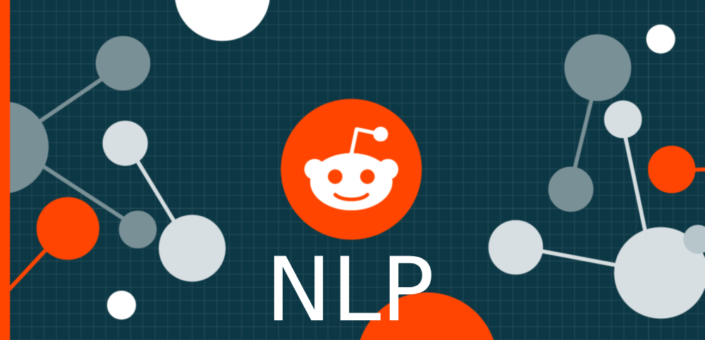
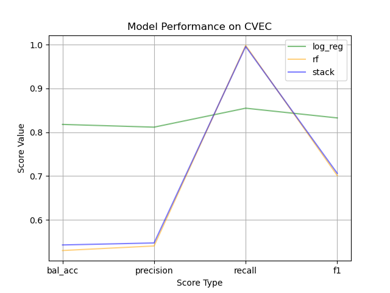

<!-- Back to top -->

<!-- PROJECT LOGO -->
 

  

  <h3 align="center">Subreddit Differentiator</h3>

  

    NLP models trained to differentiate between similar subreddits on post text. 
     
     
    <a href="https://github.com/cdenq/">GitHub Home</a>
    ·
    <a href="https://github.com/cdenq/subreddit-differentiator/issues">Report Bug </a>
    ·
    <a href="https://github.com/cdenq/my-directory">All Projects </a>
  

<!-- Table of Contents -->
# Table of Contents

  
Table of Contents

  <ol>
    <li>
      <a href="#exe-sum">Executive Summary</a>
    </li>
    <li>
      <a href="#about">About The Project</a>
      <ul>
        <li><a href="#about-ps">Problem Statement</a></li>
        <li><a href="#about-bw">Built With</a></li>
      </ul>
    </li>
    <li>
      <a href="#process">Process</a>
      <ul>
        <li><a href="#process-setup">Data Sourcing, Cleaning</a></li>
        <li><a href="#process-work">Modeling, Analysis</a></li>
      </ul>
    </li>
    <li><a href="#contact">Contact</a></li>
  </ol>

<!-- Header -->

# Executive Summary

If interested in eventually launching targetted recommendations/ads to users on various subreddits, this project provides multiple pre-trained models for early differentiation. Multiple models are given as a streamlined "launching point" for other future data science efforts.

(<a href="#readme-top">back to top</a>)

<!-- ABOUT THE PROJECT -->

# About

## Problem Statement

In the competitive and dynamic world of big data, data science teams are eager to leverage the internet's free data for insight.

This project aims to "pre-train" several NLP classification models and then provide an executive summary of the results to an existing data science client. This data science team is looking to accurately differentiate between two specific subreddits (AskReddit, AskScience) as a first step in developing targetted ads/recommendations.

Success of these pre-trained models will be based on balanced accuracy score because a "false positive" is not anymore problematic than a "false negative" in this business context. The scope of the project is limited to the data scrapped within 3 weeks on said subreddits. The model choices were limited by local compute power. The executive summary provides "future considerations" for the existing data science client, including mentions between score choice, model choice, and scope choice.

(<a href="#readme-top">back to top</a>)

## Built With

(<a href="#readme-top">back to top</a>)

<!-- ABOUT THE PROJECT -->

# Process

## Data Collection and Cleaning

Data was collected with PushShift.io (api) on the following subreddits:
- AskReddit
- AskScience

Each dataset was at around 12.5k posts. Given the nature of the project (executive summary + selling to data science team, the data is included in the repo.)

Provided Datasets
* [`askreddit_data.csv`](scrapped_data/askreddit_data.csv): AskReddit Raw Data
* [`askscience_data.csv`](scrapped_data/askscience_data.csv): AskScience Raw Data
* [`clean_ask_data.csv`](scrapped_data/clean_ask_data.csv): Cleaned Data from Both DFs

Preprocessing included extracting stems/lemma, removing non-English posts, fixing typos, and removing duplicate posts (reposts).

Likewise, prior to modeling, I applied CountVectorizer and Tfidf Vectorizer + standardization to the training corpus.

(<a href="#readme-top">back to top</a>)

## Modeling / Analysis

I applied logistic regression, random forest, and stacked model (decision tree as meta learner) on both sets, totaling 6 model comparisons.

(<a href="#readme-top">back to top</a>)

<!-- CONCLUSIONS -->

# Results

### Selected Screenshots (EDA)

(<a href="#readme-top">back to top</a>)

### Conclusion

From the model results, we see that the logistic regression is actually the best model in both cases of the cvec and tfidf data.

Random forest is slightly overfit, but overall had very weak results when trying to predict the negative class (seen in the near perfect recall score but terrible precision score).

Logisitic regression was much more overfit, but when comparing the true pos/neg rates, it had a relatively equal performance both ways.

Due to the lower performance of the RF, the stacking model suffered in suit.

The final model recommendations:
- Logistic regression if you want to prioritize balanced accuracy
- Random forest if you want to prioritize recall

(<a href="#readme-top">back to top</a>)

<!-- CONTACT -->

# Contact

If you wish to contact me, Christopher Denq, please reach out via [LinkedIn](https://www.linkedin.com/in/christopherdenq/).

If you're curious about more projects, check out my [website](https://cdenq.github.io/) or [GitHub](https://github.com/cdenq).

(<a href="#readme-top">back to top</a>)

